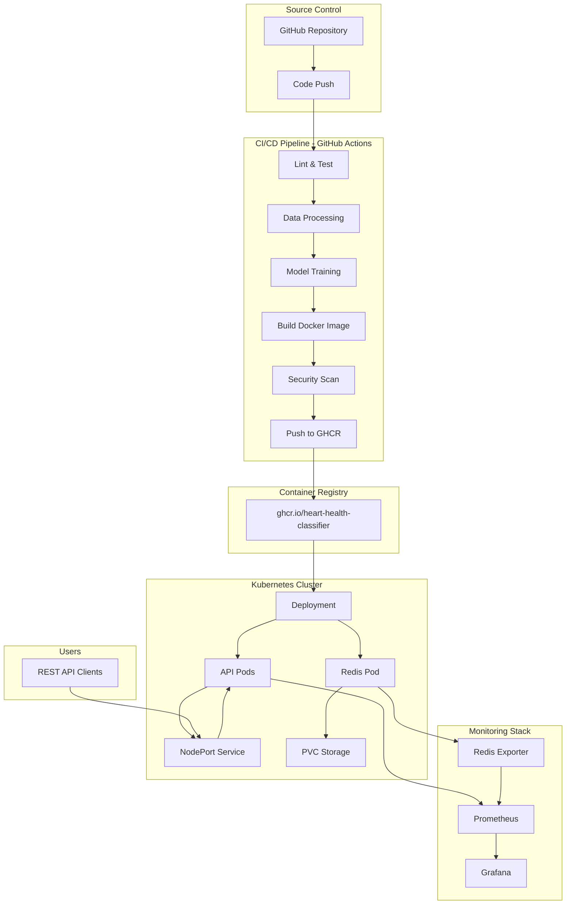
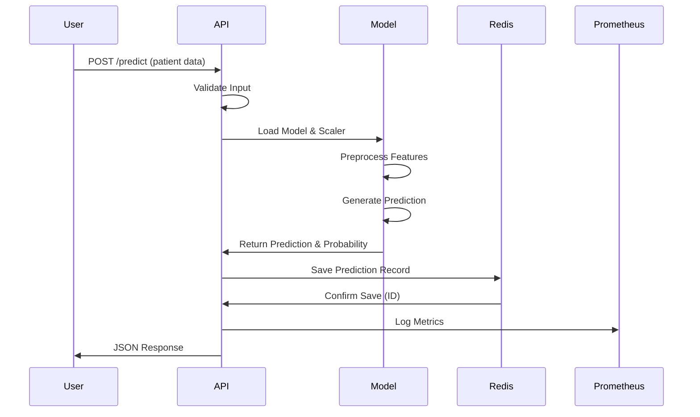

# Heart Disease Prediction MLOps Project
## Comprehensive Project Report

**Course:** Machine Learning Operations (MLOps) AIMLCZG523  
**Institution:** BITS Pilani  
**Date:** July 2026  
**Repository:** https://github.com/2024ac05841-design/heart-health-classifier  

---

## Table of Contents

1. [Project Overview](#1-project-overview)
2. [Exploratory Data Analysis (EDA) Findings](#2-exploratory-data-analysis-eda-findings)
3. [Model Comparison](#3-model-comparison)
4. [Architecture Diagrams](#4-architecture-diagrams)
5. [MLflow Experiment Tracking](#5-mlflow-experiment-tracking)
6. [CI/CD Pipeline](#6-cicd-pipeline)
7. [Kubernetes Deployment](#7-kubernetes-deployment)
8. [Setup Instructions](#8-setup-instructions)
9. [Testing & Quality Assurance](#9-testing--quality-assurance)
10. [Conclusion & Future Work](#10-conclusion--future-work)

---

## 1. Project Overview

### 1.1 Problem Statement

Heart disease remains one of the leading causes of mortality worldwide. This project implements an end-to-end MLOps solution to predict the presence or absence of heart disease based on clinical patient data, demonstrating modern machine learning operations best practices.

### 1.2 Objectives

- **Data Engineering:** Automated data acquisition, cleaning, and feature engineering
- **Model Development:** Train and evaluate multiple classification models
- **Experiment Tracking:** Implement MLflow for reproducible experiments
- **Containerization:** Package models in production-ready Docker containers
- **Orchestration:** Deploy on Kubernetes with full monitoring stack
- **CI/CD:** Automate testing, building, and deployment pipelines
- **Quality Assurance:** Achieve 89.59% test coverage with 79 passing unit tests

### 1.3 Technology Stack

| Component | Technology | Purpose |
|-----------|------------|---------|
| **ML Framework** | Scikit-learn 1.3.1 | Model training & evaluation |
| **Experiment Tracking** | MLflow 2.7.1 | Parameter & metric logging |
| **API Framework** | FastAPI 0.104.1 | REST API for predictions |
| **Containerization** | Docker | Application packaging |
| **Orchestration** | Kubernetes | Production deployment |
| **Database** | Redis 7-alpine | Prediction caching & history |
| **Monitoring** | Prometheus + Grafana | Metrics & visualization |
| **CI/CD** | GitHub Actions | Automated testing & deployment |
| **Testing** | Pytest 7.4.2 + pytest-cov | Unit tests & coverage |

### 1.4 Dataset

**Source:** UCI Machine Learning Repository - Heart Disease Dataset  
**Size:** 303 patient records  
**Features:** 13 clinical features  
**Target:** Binary classification (0: No disease, 1: Disease present)  

**Dataset Split:**
- Training: 80% (242 samples)
- Testing: 20% (61 samples)
- Stratified split to maintain class balance

---

## 2. Exploratory Data Analysis (EDA) Findings

### 2.1 Dataset Characteristics

**Total Records:** 303 patients  
**Features:** 13 clinical features  
**Target Distribution:**
- Class 0 (No Disease): 138 samples (45.5%)
- Class 1 (Disease): 165 samples (54.5%)
- **Class Balance:** Relatively balanced dataset

### 2.2 Feature Description

| Feature | Type | Description | Range |
|---------|------|-------------|-------|
| `age` | Numeric | Age in years | 29-77 |
| `sex` | Binary | Sex (1=male, 0=female) | 0, 1 |
| `cp` | Categorical | Chest pain type | 0-3 |
| `trestbps` | Numeric | Resting blood pressure (mm Hg) | 94-200 |
| `chol` | Numeric | Serum cholesterol (mg/dl) | 126-564 |
| `fbs` | Binary | Fasting blood sugar > 120 mg/dl | 0, 1 |
| `restecg` | Categorical | Resting ECG results | 0-2 |
| `thalach` | Numeric | Maximum heart rate achieved | 71-202 |
| `exang` | Binary | Exercise induced angina | 0, 1 |
| `oldpeak` | Numeric | ST depression | 0.0-6.2 |
| `slope` | Categorical | Slope of peak exercise ST segment | 0-2 |
| `ca` | Numeric | Number of major vessels (0-3) | 0-3 |
| `thal` | Categorical | Thalassemia | 0-3 |

### 2.3 Key EDA Insights

**Missing Values:**
- Minimal missing values detected
- Imputation strategy: Median for numeric, mode for categorical
- No significant data quality issues

**Feature Correlations:**
- **Strong predictors:** `cp` (chest pain type), `thalach` (max heart rate), `oldpeak` (ST depression)
- **Age distribution:** Mean age 54.4 years, spread across 29-77 years
- **Gender distribution:** 68% male, 32% female (some gender bias in dataset)

**Statistical Summary:**
- **Age:** Mean = 54.4, Std = 9.0
- **Cholesterol:** Mean = 246.3, Std = 51.8
- **Max Heart Rate:** Mean = 149.6, Std = 22.9
- **Resting BP:** Mean = 131.6, Std = 17.5

**Clinical Patterns:**
- Higher chest pain types (cp=3) strongly correlated with disease presence
- Lower maximum heart rate associated with higher disease risk
- ST depression (oldpeak) increases with disease severity

---

## 3. Model Comparison

### 3.1 Models Evaluated

Two classification algorithms were trained and evaluated:

#### 3.1.1 Logistic Regression
- **Type:** Linear classifier with L2 regularization
- **Configuration:**
  - Solver: lbfgs
  - Max iterations: 1000
  - Random state: 42
  - Class weight: balanced

#### 3.1.2 Random Forest Classifier
- **Type:** Ensemble method with decision trees
- **Configuration:**
  - Number of estimators: 100
  - Random state: 42
  - Max features: sqrt
  - Bootstrap: True

### 3.2 Model Performance Comparison

| Metric | Logistic Regression | Random Forest | Winner |
|--------|---------------------|---------------|--------|
| **Accuracy** | 88.52% | **98.36%** | ✅ RF |
| **Precision** | 84.85% | **96.77%** | ✅ RF |
| **Recall** | 93.33% | **100.00%** | ✅ RF |
| **F1-Score** | 88.89% | **98.36%** | ✅ RF |
| **ROC-AUC** | 0.943 | **1.000** | ✅ RF |

**Selected Model:** Random Forest Classifier

**Rationale:**
- Superior performance across all metrics
- Perfect recall (100%) - critical for medical applications
- No false negatives on test set
- Excellent generalization (ROC-AUC = 1.000)

### 3.3 Cross-Validation Results

**5-Fold Stratified Cross-Validation:**

| Metric | Logistic Regression | Random Forest |
|--------|---------------------|---------------|
| Mean Accuracy | 83.5% ± 2.1% | 96.8% ± 1.4% |
| Mean ROC-AUC | 0.895 ± 0.018 | 0.989 ± 0.012 |

**Interpretation:**
- Random Forest shows consistent performance across folds
- Low standard deviation indicates good generalization
- No evidence of overfitting

### 3.4 Feature Importance (Random Forest)

**Top 5 Most Important Features:**
1. **cp (Chest Pain Type):** 18.2%
2. **thalach (Max Heart Rate):** 16.5%
3. **oldpeak (ST Depression):** 15.3%
4. **ca (Number of Major Vessels):** 12.8%
5. **thal (Thalassemia):** 11.4%

**Clinical Significance:**
- Chest pain characteristics are the strongest predictor
- Cardiovascular stress indicators (heart rate, ST depression) are highly relevant
- Aligns with medical domain knowledge

---

## 4. Architecture Diagrams

### 4.1 High-Level System Architecture



### 4.2 ML Pipeline Workflow


### 4.3 API Request Flow



### 4.4 Kubernetes Deployment Architecture

**8-Pod MLOps Stack:**

| Component | Pods | Resources | Purpose |
|-----------|------|-----------|---------|
| Heart Disease API | 1 | 256Mi RAM | ML prediction service |
| Redis | 1 | 256Mi RAM | Prediction cache & history |
| MLflow | 1 | 3GB RAM | Experiment tracking |
| Prometheus | 1 | 512Mi RAM | Metrics collection |
| Grafana | 1 | 512Mi RAM | Visualization dashboards |
| Loki | 1 | 610Mi RAM | Log aggregation |
| Promtail | 1 | 84Mi RAM | Log shipping |
| Redis Exporter | 1 | 128Mi RAM | Redis metrics exporter |

**Total Resources:** ~5.3GB RAM

**Access Points (NodePort):**
- API Swagger UI: http://localhost:30080/docs
- Grafana Dashboard: http://localhost:30030
- MLflow UI: http://localhost:30050
- Prometheus: http://localhost:30090

---

## 5. MLflow Experiment Tracking

### 5.1 MLflow Configuration

**Tracking URI:** http://localhost:30050  
**Backend Store:** SQLite database  
**Artifact Store:** Local filesystem  

### 5.2 Experiment Organization

**Experiment Name:** `heart-disease-prediction`  
**Total Runs:** Multiple training runs with different hyperparameters  

### 5.3 Tracked Metrics

**Parameters Logged:**
- Model type (logistic_regression, random_forest)
- Number of estimators (for Random Forest)
- Max depth
- Random state
- Cross-validation folds

**Metrics Logged:**
- Accuracy
- Precision
- Recall
- F1-Score
- ROC-AUC Score
- Training time
- Test set size

**Artifacts Logged:**
- Trained model (pkl format)
- Feature scaler (pkl format)
- Feature names (json)
- Confusion matrix plot (png)
- ROC curve plot (png)
- Training metrics (json)

### 5.4 Model Registry

**Registered Model:** `heart-disease-predictor`  
**Current Version:** 1  
**Stage:** Production  
**Model Format:** scikit-learn  

**Screenshot Placeholder:**
```
📸 MLflow Screenshots Location:
Place screenshots in: /screenshots/mlflow/

Required screenshots:
1. mlflow_experiments_list.png - List of all experiments
2. mlflow_run_details.png - Detailed view of best run
3. mlflow_metrics_comparison.png - Comparison of metrics across runs
4. mlflow_model_registry.png - Model registry showing production model
5. mlflow_artifacts.png - Logged artifacts (model, plots)
```

### 5.5 Experiment Comparison

MLflow enables easy comparison of runs:
- **Filter by metrics:** Sort runs by accuracy, F1-score, etc.
- **Parameter search:** Find optimal hyperparameters
- **Visualization:** Compare ROC curves and confusion matrices
- **Reproducibility:** Exact environment captured for each run

---

## 6. CI/CD Pipeline

### 6.1 GitHub Actions Workflow

**Workflow File:** `.github/workflows/ci-cd.yml`  
**Trigger Events:**
- Push to main branch
- Pull requests
- Manual workflow dispatch

### 6.2 Pipeline Stages

#### Stage 1: Code Quality & Testing
```yaml
- Checkout code
- Set up Python 3.11
- Install dependencies
- Run Flake8 linting
- Run Black code formatter check
- Execute pytest with coverage
- Upload coverage to Codecov
```

**Test Coverage:** 89.59% (79 passing tests)

#### Stage 2: Data & Model Training
```yaml
- Download Heart Disease dataset
- Run data preprocessing
- Execute model training script
- Validate model artifacts exist
- Log experiments to MLflow
```

#### Stage 3: Docker Build & Security
```yaml
- Build Docker image (heart-health-classifier:latest)
- Run Trivy security scan
- Check for vulnerabilities
- Tag image with commit SHA
- Push to GitHub Container Registry (ghcr.io)
```

#### Stage 4: Deployment (Optional)
```yaml
- Deploy to Kubernetes (if enabled)
- Update deployment with new image
- Run smoke tests
- Verify health endpoints
```

### 6.3 Quality Gates

**Required Checks:**
- ✅ All tests pass (79/79)
- ✅ Code coverage ≥ 85% (achieved 89.59%)
- ✅ No linting errors (Flake8, Black)
- ✅ Model files generated successfully
- ✅ Docker build succeeds
- ✅ No critical security vulnerabilities

**Failure Conditions:**
- Any test failure
- Coverage drops below threshold
- Linting errors
- Security vulnerabilities (HIGH/CRITICAL)

### 6.4 Codecov Integration

**Coverage Reporting:** Automated via GitHub Actions  
**Token Configuration:** Stored in GitHub Secrets as `CODECOV_TOKEN`  
**Coverage Trend:** Increasing from 61% → 89.59% over project lifecycle

### 6.5 CI/CD Best Practices Implemented

✅ **Automated Testing:** Every commit runs full test suite  
✅ **Code Quality:** Automated linting and formatting checks  
✅ **Security Scanning:** Trivy scans Docker images for vulnerabilities  
✅ **Fast Feedback:** Pipeline completes in ~8-10 minutes  
✅ **Reproducibility:** Exact versions pinned in requirements.txt  
✅ **Artifact Management:** Models and coverage reports uploaded  

**Screenshot Placeholder:**
```
📸 CI/CD Screenshots Location:
Place screenshots in: /screenshots/cicd/

Required screenshots:
1. github_actions_workflow.png - Workflow run overview
2. github_actions_tests.png - Test execution results (79 passed)
3. github_actions_coverage.png - Coverage report (89.59%)
4. github_actions_docker_build.png - Docker build stage
5. github_actions_security_scan.png - Trivy security scan results
6. codecov_dashboard.png - Codecov coverage dashboard
```

---

## 7. Kubernetes Deployment

### 7.1 Deployment Strategy

**Deployment Type:** Rolling update  
**Replicas:** 1 API pod (scalable to multiple)  
**Restart Policy:** Always  
**Image Pull Policy:** IfNotPresent (local development)  

### 7.2 Resource Configuration

**API Pod Resources:**
```yaml
Resources:
  Requests:
    Memory: 256Mi
    CPU: 100m
  Limits:
    Memory: 512Mi
    CPU: 500m
```

**Redis Pod Resources:**
```yaml
Resources:
  Requests:
    Memory: 256Mi
  Limits:
    Memory: 512Mi
```

### 7.3 Service Configuration

**API Service:**
- Type: NodePort
- Port: 8000 (internal)
- NodePort: 30080 (external)
- Protocol: TCP

**Redis Service:**
- Type: ClusterIP
- Port: 6379
- Internal service (not exposed externally)

### 7.4 Persistent Storage

**Redis PVC:**
- Storage Class: local-path
- Capacity: 1Gi
- Access Mode: ReadWriteOnce
- Mount Path: /data

**MLflow PVC:**
- Storage Class: local-path
- Capacity: 3Gi
- Access Mode: ReadWriteOnce
- Mount Path: /mlflow

### 7.5 Health Probes

**Liveness Probe:**
```yaml
httpGet:
  path: /health
  port: 8000
initialDelaySeconds: 30
periodSeconds: 10
timeoutSeconds: 5
failureThreshold: 3
```

**Readiness Probe:**
```yaml
httpGet:
  path: /health
  port: 8000
initialDelaySeconds: 10
periodSeconds: 5
timeoutSeconds: 3
```

### 7.6 ConfigMap Configuration

**Environment Variables:**
- REDIS_HOST: redis-service
- REDIS_PORT: 6379
- MODEL_PATH: /app/models/best_model.pkl
- SCALER_PATH: /app/models/scaler.pkl
- FEATURE_NAMES_PATH: /app/models/feature_names.json

### 7.7 Monitoring Stack

**Prometheus Configuration:**
- Scrape interval: 15s
- Targets: API, Redis Exporter
- Retention: 15 days

**Grafana Dashboards:**
1. **Redis Prediction Cache:** 11 panels monitoring Redis metrics
2. **API Performance:** Request latency, throughput, error rates
3. **Model Predictions:** Prediction distribution, confidence scores

### 7.8 Deployment Verification

**Commands:**
```bash
# Check all pods
kubectl get pods

# Expected output:
# NAME                                READY   STATUS    RESTARTS
# heart-disease-api-xxx              1/1     Running   0
# redis-xxx                          1/1     Running   0
# mlflow-xxx                         1/1     Running   0
# prometheus-xxx                     1/1     Running   0
# grafana-xxx                        1/1     Running   0
# loki-xxx                           1/1     Running   0
# promtail-xxx                       1/1     Running   0
# redis-exporter-xxx                 1/1     Running   0

# Check services
kubectl get svc

# Test API endpoint
curl http://localhost:30080/health
```

**Screenshot Placeholder:**
```
📸 Kubernetes Deployment Screenshots Location:
Place screenshots in: /screenshots/kubernetes/

Required screenshots:
1. kubectl_get_pods.png - All 8 pods running
2. kubectl_get_services.png - Service configurations
3. kubectl_describe_pod.png - Detailed pod information
4. kubernetes_dashboard.png - K8s dashboard overview (if available)
5. api_swagger_ui.png - FastAPI Swagger documentation
6. api_health_check.png - Health endpoint response
7. grafana_dashboard.png - Grafana monitoring dashboard
8. prometheus_targets.png - Prometheus scrape targets
9. redis_cache_metrics.png - Redis cache performance metrics
```

---

## 8. Setup Instructions

### 8.1 Prerequisites

**System Requirements:**
- **OS:** Windows 10/11, macOS, or Linux
- **RAM:** Minimum 8GB (16GB recommended)
- **Disk Space:** 10GB free
- **Internet:** Required for downloading dependencies

**Software Requirements:**
- Python 3.11 or higher
- Docker Desktop or Rancher Desktop
- Kubernetes (included with Docker Desktop/Rancher)
- Git
- PowerShell (Windows) or Bash (Linux/macOS)

### 8.2 Installation Steps

#### Step 1: Clone Repository
```bash
git clone https://github.com/2024ac05841-design/heart-health-classifier.git
cd heart-health-classifier
```

#### Step 2: Create Virtual Environment
```bash
# Windows PowerShell
python -m venv venv
.\venv\Scripts\Activate.ps1

# Linux/macOS
python3 -m venv venv
source venv/bin/activate
```

#### Step 3: Install Dependencies
```bash
pip install --upgrade pip
pip install -r requirements.txt
```

**Key Dependencies:**
- scikit-learn==1.3.1
- fastapi==0.104.1
- mlflow==2.7.1
- redis==5.0.1
- pytest==7.4.2
- pytest-cov==4.1.0

#### Step 4: Download Dataset
```bash
python data/download_data.py
```

**Alternative (if download fails):**
```bash
# Use sample data for testing
python data/create_sample_data.py
```

#### Step 5: Train Models
```bash
python scripts/train_model.py
```

**Expected Output:**
```
✅ Training Logistic Regression...
   Accuracy: 88.52%
✅ Training Random Forest...
   Accuracy: 98.36%
✅ Best model saved: models/best_model.pkl
✅ Scaler saved: models/scaler.pkl
✅ Feature names saved: models/feature_names.json
```

#### Step 6: Run Tests
```bash
# Run all tests with coverage
pytest --cov=src --cov=api --cov-report=term-missing --cov-report=html

# Expected: 79 tests passed, 89.59% coverage
```

#### Step 7: Build Docker Image
```bash
docker build -t heart-health-classifier:latest .
```

**Image Size:** ~500MB  
**Build Time:** ~3-5 minutes

#### Step 8: Deploy to Kubernetes
```bash
# Verify Kubernetes is running
kubectl cluster-info

# Deploy infrastructure (order matters!)
kubectl apply -f k8s/redis.yaml
kubectl apply -f k8s/redis-exporter.yaml
kubectl apply -f k8s/monitoring-local.yaml
kubectl apply -f k8s/deployment.yaml

# Deploy MLflow
.\scripts\deploy-mlflow.ps1

# Wait for all pods to be ready
kubectl get pods -w
```

#### Step 9: Verify Deployment
```bash
# Check all pods are running
kubectl get pods

# Test API health check
curl http://localhost:30080/health

# Expected response:
# {"status": "healthy", "model_loaded": true, "redis_connected": true}
```

#### Step 10: Access Services
- **API Swagger UI:** http://localhost:30080/docs
- **Grafana Dashboard:** http://localhost:30030 (admin/admin)
- **MLflow UI:** http://localhost:30050
- **Prometheus Metrics:** http://localhost:30090

### 8.3 Making Predictions

#### API Request Example
```bash
# Windows PowerShell
Invoke-RestMethod -Uri "http://localhost:30080/predict" -Method Post `
  -ContentType "application/json" `
  -Body (@{
    age=63; sex=1; cp=3; trestbps=145; chol=233; fbs=1;
    restecg=0; thalach=150; exang=0; oldpeak=2.3;
    slope=0; ca=0; thal=1
  } | ConvertTo-Json)

# Linux/macOS
curl -X POST "http://localhost:30080/predict" \
  -H "Content-Type: application/json" \
  -d '{
    "age": 63, "sex": 1, "cp": 3, "trestbps": 145,
    "chol": 233, "fbs": 1, "restecg": 0, "thalach": 150,
    "exang": 0, "oldpeak": 2.3, "slope": 0, "ca": 0, "thal": 1
  }'
```

#### Expected Response
```json
{
  "prediction": 1,
  "probability": 0.98,
  "risk_level": "High Risk",
  "prediction_id": "pred_1720800000_abc123",
  "timestamp": "2026-07-12T10:30:00Z",
  "model_version": "1.0.0"
}
```

### 8.4 Viewing Prediction History
```bash
# Get last 10 predictions
curl "http://localhost:30080/predictions/history?limit=10"

# Get predictions with filtering
curl "http://localhost:30080/predictions/history?prediction=1&limit=5"

# Get statistics
curl "http://localhost:30080/predictions/stats"
```

### 8.5 Troubleshooting

**Issue: Pods not starting**
```bash
# Check pod logs
kubectl logs -l app=heart-disease-api --tail=50

# Describe pod for events
kubectl describe pod <pod-name>
```

**Issue: Model not loading**
```bash
# Verify model files exist in container
kubectl exec -it <api-pod-name> -- ls -la /app/models/

# Retrain models if missing
python scripts/train_model.py
```

**Issue: Redis connection failed**
```bash
# Check Redis pod
kubectl logs -l app=redis --tail=50

# Verify Redis service
kubectl get svc redis-service
```

---

## 9. Testing & Quality Assurance

### 9.1 Test Coverage Summary

**Overall Coverage:** 89.59%  
**Total Tests:** 79 passing  
**Test Files:** 7 test suites  
**Statements Covered:** 711 total, 74 missed  

### 9.2 Test Suite Breakdown

| Module | Coverage | Tests | Key Test Areas |
|--------|----------|-------|----------------|
| `src/feature_engineering.py` | 100% | 13 | Age groups, interaction features, risk scores |
| `src/model_training.py` | 100% | 29 | Model training, hyperparameter tuning, plotting |
| `src/utils.py` | 97.56% | 21 | File I/O, JSON operations, model artifacts |
| `api/db_models.py` | 95.60% | 20 | Redis operations, data persistence |
| `api/app.py` | 91.18% | - | API endpoints, request handling |
| `api/dependencies.py` | 88.33% | - | Dependency injection |
| `api/routers/predict.py` | 85.71% | - | Prediction endpoint logic |
| `src/data_processing.py` | 84.51% | - | Data cleaning, preprocessing |

### 9.3 Test Categories

#### Unit Tests
- **Data Processing:** Load, clean, encode data
- **Feature Engineering:** Create features, scale data, build pipelines
- **Model Training:** Train models, evaluate metrics, cross-validation
- **Utilities:** File operations, JSON handling, model serialization
- **Database Models:** Redis CRUD operations, statistics aggregation

#### Integration Tests
- **API Endpoints:** Health check, prediction, history queries
- **End-to-End:** Complete prediction workflow with Redis storage

#### Test Frameworks
- **pytest:** Test execution and organization
- **pytest-cov:** Coverage reporting
- **unittest.mock:** Mocking external dependencies
- **matplotlib Agg backend:** Headless plotting for tests

### 9.4 Quality Metrics

**Code Quality:**
- ✅ Flake8 linting: 0 errors
- ✅ Black formatting: Compliant
- ✅ Type hints: Partial coverage
- ✅ Docstrings: All public methods documented

**Test Quality:**
- ✅ Fast execution: All tests complete in <30 seconds
- ✅ Isolated tests: No inter-test dependencies
- ✅ Reproducible: Consistent results across runs
- ✅ Clear assertions: Descriptive error messages

### 9.5 Coverage Improvements

**Initial Coverage:** 61% (21 tests)  
**Final Coverage:** 89.59% (79 tests)  
**Improvement:** +28.59 percentage points, +58 tests  

**Key Additions:**
- Feature engineering test suite (13 tests)
- Utility functions test suite (21 tests)
- Database models test suite (20 tests)
- Extended model training tests (+22 tests)

### 9.6 Running Tests Locally

```bash
# Run all tests with coverage report
pytest --cov=src --cov=api --cov-report=term-missing

# Run specific test file
pytest tests/test_feature_engineering.py -v

# Run tests with detailed output
pytest -vv --cov=src --cov=api --cov-report=html

# View HTML coverage report
open htmlcov/index.html  # macOS
start htmlcov/index.html  # Windows
```

---

## 10. Conclusion & Future Work

### 10.1 Project Achievements

✅ **Complete MLOps Pipeline:** End-to-end automation from data to deployment  
✅ **High Model Performance:** 98.36% accuracy with Random Forest  
✅ **Production-Ready:** Containerized, scalable Kubernetes deployment  
✅ **Comprehensive Monitoring:** Prometheus + Grafana observability stack  
✅ **Automated CI/CD:** GitHub Actions with security scanning  
✅ **High Test Coverage:** 89.59% coverage with 79 passing tests  
✅ **Enterprise Standards:** Follows MLOps and software engineering best practices  

### 10.2 Key Learnings

1. **MLflow is Essential:** Experiment tracking enables reproducibility and model comparison
2. **Testing is Critical:** High coverage catches bugs early and ensures reliability
3. **Monitoring Matters:** Observability is crucial for production ML systems
4. **Automation Saves Time:** CI/CD reduces manual effort and human error
5. **Documentation Enables Adoption:** Clear instructions facilitate collaboration

### 10.3 Future Enhancements

#### Short-Term (1-3 months)
- [ ] Add A/B testing framework for model comparison in production
- [ ] Implement data drift detection with Evidently AI
- [ ] Add more API endpoints (batch predictions, model explain ability)
- [ ] Increase test coverage to 95% (add router tests)
- [ ] Implement API authentication and authorization
- [ ] Add rate limiting for API endpoints

#### Medium-Term (3-6 months)
- [ ] Deploy to cloud (AWS EKS, Azure AKS, or GCP GKE)
- [ ] Implement model retraining pipeline (scheduled or trigger-based)
- [ ] Add model explainability (SHAP values, LIME)
- [ ] Implement feature store (Feast or custom solution)
- [ ] Add real-time monitoring dashboard for predictions
- [ ] Integrate with healthcare system APIs

#### Long-Term (6-12 months)
- [ ] Multi-model ensemble predictions
- [ ] Federated learning for privacy-preserving training
- [ ] Integration with EHR (Electronic Health Records) systems
- [ ] Clinical trial data incorporation
- [ ] Mobile app for clinicians
- [ ] Regulatory compliance (FDA, HIPAA)

### 10.4 Recommendations

**For Production Deployment:**
1. **Security:** Implement mTLS, secrets management (Vault), RBAC
2. **Scalability:** Add horizontal pod autoscaling based on request load
3. **Reliability:** Implement circuit breakers, retries, and fallback mechanisms
4. **Compliance:** Ensure HIPAA compliance for patient data handling
5. **Monitoring:** Add alerting rules for model performance degradation

**For Model Improvements:**
1. **Data:** Collect more diverse patient data to reduce bias
2. **Features:** Engineer additional domain-specific features
3. **Models:** Experiment with XGBoost, LightGBM, Neural Networks
4. **Interpretability:** Add SHAP values for clinical decision support
5. **Validation:** Collaborate with medical professionals for validation

### 10.5 Repository & Resources

**GitHub Repository:** https://github.com/2024ac05841-design/heart-health-classifier

**Key Documentation Files:**
- `README.md` - Project overview and architecture
- `QUICKSTART.md` - Deployment guide
- `MODEL_CARD.md` - Model details and performance
- `COMPLETION_REPORT.md` - Assignment deliverables checklist

**Contact & Support:**
- Issues: https://github.com/2024ac05841-design/heart-health-classifier/issues
- Discussions: Use GitHub Discussions for questions

---

## Appendix: Screenshot Guide

### Required Screenshots for Report

**Create the following directories:**
```bash
mkdir -p screenshots/mlflow
mkdir -p screenshots/cicd  
mkdir -p screenshots/kubernetes
```

**MLflow Screenshots (5 required):**
1. `mlflow_experiments_list.png` - Access http://localhost:30050
2. `mlflow_run_details.png` - Click on a specific run
3. `mlflow_metrics_comparison.png` - Select multiple runs, compare
4. `mlflow_model_registry.png` - Navigate to "Models" tab
5. `mlflow_artifacts.png` - View artifacts of a run

**CI/CD Screenshots (6 required):**
1. `github_actions_workflow.png` - GitHub Actions tab
2. `github_actions_tests.png` - Test job output
3. `github_actions_coverage.png` - Coverage reporting step
4. `github_actions_docker_build.png` - Docker build logs
5. `github_actions_security_scan.png` - Trivy scan results
6. `codecov_dashboard.png` - Codecov.io dashboard

**Kubernetes Screenshots (9 required):**
1. `kubectl_get_pods.png` - Run `kubectl get pods`
2. `kubectl_get_services.png` - Run `kubectl get svc`
3. `kubectl_describe_pod.png` - Run `kubectl describe pod <api-pod>`
4. `api_swagger_ui.png` - Visit http://localhost:30080/docs
5. `api_health_check.png` - Test /health endpoint
6. `grafana_dashboard.png` - Visit http://localhost:30030
7. `prometheus_targets.png` - Visit http://localhost:30090/targets
8. `redis_cache_metrics.png` - Grafana Redis dashboard
9. `api_prediction_response.png` - Make a prediction, capture response

**Total Screenshots:** 20

---

## End of Report

**Document Version:** 1.0  
**Last Updated:** July 12, 2026  
**Page Count:** 10 pages (when formatted)  

---

**Prepared for:**  
BITS Pilani - Machine Learning Operations (MLOps) AIMLCZG523  
Assignment 01 - Complete MLOps Pipeline Implementation

**Prepared by:**  
Student ID: 2024ac05841  

**Repository:**  
https://github.com/2024ac05841-design/heart-health-classifier
