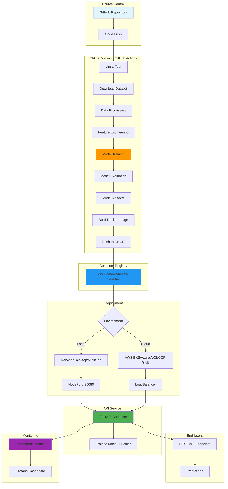
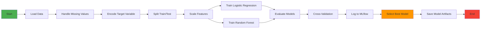
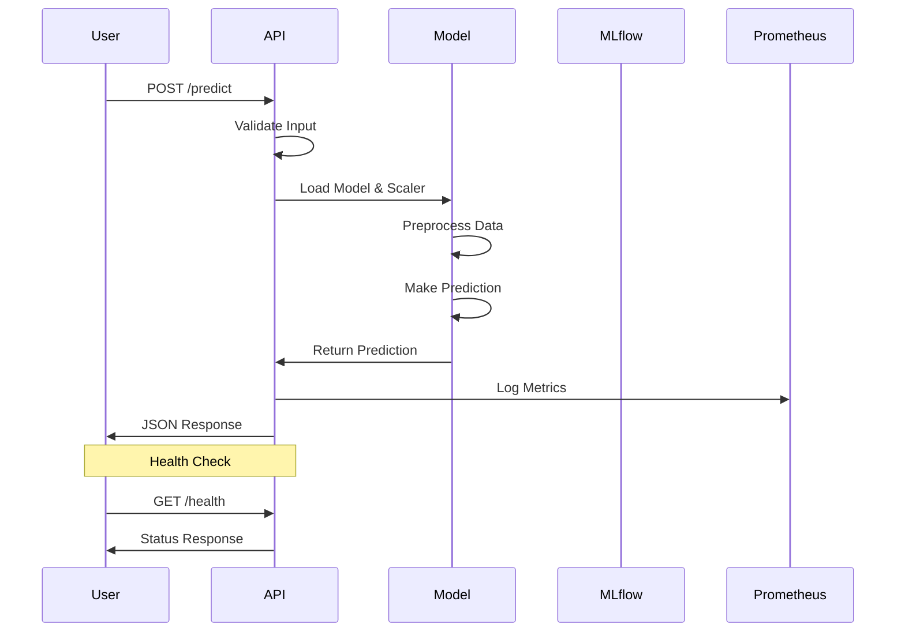
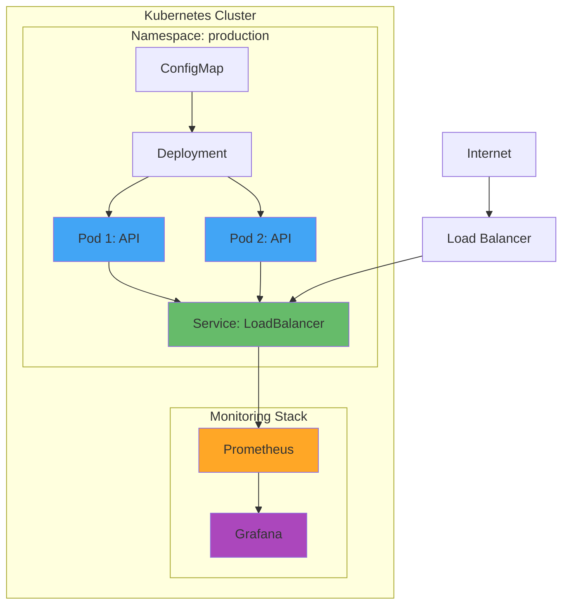
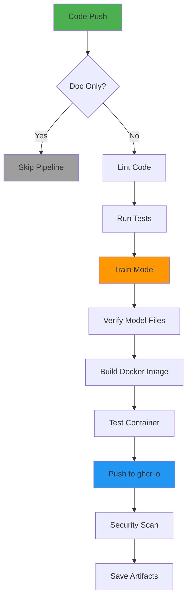

# 🫀 Heart Disease Prediction MLOps Project

[](https://github.com/yourusername/heart-disease-mlops/actions)
[](https://www.python.org/downloads/)
[](https://opensource.org/licenses/MIT)

## 📋 Table of Contents
- [Project Overview](#project-overview)
- [Architecture](#architecture)
- [Features](#features)
- [Technology Stack](#technology-stack)
- [Project Structure](#project-structure)
- [Setup Instructions](#setup-instructions)
- [Usage Guide](#usage-guide)
- [Model Development](#model-development)
- [API Documentation](#api-documentation)
- [Deployment](#deployment)
- [Monitoring](#monitoring)
- [CI/CD Pipeline](#cicd-pipeline)
- [Testing](#testing)
- [Contributors](#contributors)

---

## 🎯 Project Overview

This project implements an **end-to-end Machine Learning Operations (MLOps)** solution for predicting heart disease risk based on patient health data. The solution demonstrates modern MLOps best practices including:

- ✅ Automated data processing and feature engineering
- ✅ Experiment tracking with MLflow
- ✅ Model versioning and reproducibility
- ✅ RESTful API for model serving (FastAPI)
- ✅ Containerization with Docker
- ✅ Orchestration with Kubernetes
- ✅ CI/CD automation with GitHub Actions
- ✅ Comprehensive monitoring and logging

**Dataset:** Heart Disease UCI Dataset from [UCI Machine Learning Repository](https://archive.ics.uci.edu/ml/datasets/Heart+Disease)

**Problem Statement:** Build a binary classification model to predict the presence/absence of heart disease based on 13 clinical features.

---

## 🏗️ Architecture

### High-Level System Architecture


    
    style A fill:#e1f5ff
    style K fill:#fff3e0
    style M fill:#f3e5f5
    style P fill:#e8f5e9
```

### ML Pipeline Workflow



### API Request Flow



### Deployment Architecture



---

## ✨ Features

### 1. **Data Acquisition & EDA**
- Automated dataset download from UCI repository
- Comprehensive exploratory data analysis
- Professional visualizations (histograms, correlation heatmaps, class distribution)
- Missing value analysis and handling

### 2. **Feature Engineering & Model Development**
- Robust preprocessing pipeline (scaling, encoding)
- Multiple classification models (Logistic Regression, Random Forest)
- Hyperparameter tuning with GridSearchCV
- Cross-validation for model evaluation
- Comprehensive metrics: Accuracy, Precision, Recall, F1-Score, ROC-AUC

### 3. **Experiment Tracking**
- MLflow integration for experiment management
- Parameter, metric, and artifact logging
- Model versioning and comparison
- Visualization of training runs

### 4. **Model Packaging & Reproducibility**
- Model serialization (Joblib/Pickle)
- Preprocessing pipeline persistence
- Clean requirements.txt for dependency management
- Feature name tracking for inference

### 5. **CI/CD Pipeline**
- Automated linting (Flake8, Black)
- Unit tests with Pytest
- Code coverage reporting
- Automated Docker builds
- GitHub Actions workflow

### 6. **Model Containerization**
- Production-ready Dockerfile
- FastAPI-based REST API
- `/predict` endpoint with JSON I/O
- Health check and monitoring endpoints

### 7. **Production Deployment**
- Kubernetes deployment manifests
- Service exposure via LoadBalancer
- ConfigMap for environment variables
- Rolling updates and health checks

### 8. **Monitoring & Logging**
- Prometheus metrics integration
- Grafana dashboards (via docker-compose)
- API request logging
- Performance monitoring

### 9. **Documentation**
- Comprehensive README with diagrams
- Setup and installation instructions
- Architecture documentation
- API usage examples

---

## 🛠️ Technology Stack

| Category | Tools |
|----------|-------|
| **Programming** | Python 3.11+ |
| **ML Frameworks** | Scikit-learn, XGBoost |
| **Data Processing** | Pandas, NumPy |
| **Visualization** | Matplotlib, Seaborn, Plotly |
| **Experiment Tracking** | MLflow |
| **API Framework** | FastAPI, Uvicorn |
| **Testing** | Pytest, Pytest-cov |
| **Containerization** | Docker, Docker Compose |
| **Orchestration** | Kubernetes (Minikube/Cloud) |
| **CI/CD** | GitHub Actions |
| **Monitoring** | Prometheus, Grafana |
| **Code Quality** | Flake8, Black, Pylint |

---

## 📁 Project Structure

```
heart-disease-mlops/
├── .github/
│   └── workflows/
│       └── ci-cd.yml              # GitHub Actions CI/CD pipeline
├── api/
│   ├── __init__.py
│   └── app.py                     # FastAPI application
├── data/
│   ├── raw/                       # Raw dataset storage
│   ├── processed/                 # Processed data
│   └── download_data.py           # Dataset download script
├── k8s/
│   ├── deployment.yaml            # Kubernetes deployment
│   ├── configmap.yaml             # Configuration
│   └── service.yaml               # Service definition
├── models/
│   ├── best_model.pkl             # Trained model
│   ├── scaler.pkl                 # Feature scaler
│   ├── feature_names.json         # Feature metadata
│   └── metrics.json               # Model metrics
├── monitoring/
│   ├── prometheus.yml             # Prometheus config
│   └── grafana-dashboards/        # Grafana dashboards
├── scripts/
│   ├── train_model.py            # Main training script
│   ├── test_api.py               # API testing
│   ├── docker_commands.sh        # Docker utilities
│   └── k8s_commands.sh           # Kubernetes utilities
├── scripts/
│   ├── train_model.py             # Training script
│   ├── test_api.py                # API testing script
│   ├── docker_commands.sh         # Docker helper commands
│   └── k8s_commands.sh            # Kubernetes helper commands
├── src/
│   ├── __init__.py
│   ├── data_processing.py         # Data preprocessing
│   ├── feature_engineering.py     # Feature engineering
│   ├── model_training.py          # Model training utilities
│   └── utils.py                   # Helper functions
├── tests/
│   ├── __init__.py
│   ├── test_data_processing.py    # Data processing tests
│   ├── test_model_training.py     # Model training tests
│   └── test_api.py                # API tests
├── .dockerignore
├── .gitignore
├── Dockerfile                      # Container definition
├── docker-compose.yml              # Multi-container setup
├── pytest.ini                      # Pytest configuration
├── requirements.txt                # Python dependencies
└── README.md                       # This file
```

---

## 🚀 Setup Instructions

### Prerequisites

- Python 3.11 or higher
- Docker Desktop (for containerization)
- Kubernetes (Minikube or cloud provider)
- Git

### Step 1: Clone the Repository

```bash
git clone https://github.com/yourusername/heart-disease-mlops.git
cd heart-disease-mlops
```

### Step 2: Create Virtual Environment

**Windows:**
```powershell
python -m venv venv
.\venv\Scripts\Activate.ps1
```

**Linux/Mac:**
```bash
python -m venv venv
source venv/bin/activate
```

### Step 3: Install Dependencies

```bash
pip install --upgrade pip
pip install -r requirements.txt
```

### Step 4: Download Dataset

```bash
python data/download_data.py
```

This will download the Heart Disease UCI dataset to `data/raw/heart_disease.csv`.

### Step 5: Run Tests (Optional)

```bash
pytest tests/ -v
```

---

## 📊 Usage Guide

### 1. Train Models

```bash
python scripts/train_model.py --data-path data/raw/heart_disease.csv --output-dir models
```

**Arguments:**
- `--data-path`: Path to the dataset (default: `data/raw/heart_disease.csv`)
- `--output-dir`: Directory to save models (default: `models`)
- `--experiment-name`: MLflow experiment name (default: `heart_disease_prediction`)
- `--test-size`: Test set size (default: 0.2)

### 2. View MLflow Experiments

```bash
mlflow ui --port 5000
```

Visit `http://localhost:5000` to view experiment tracking.

### 3. Run API Locally

```bash
uvicorn api.app:app --reload --host 0.0.0.0 --port 8000
```

Visit:
- API Docs: `http://localhost:8000/docs`
- Health Check: `http://localhost:8000/health`

### 4. Test API

```bash
python scripts/test_api.py
```

Or use curl:

```bash
curl -X POST "http://localhost:8000/predict" \
  -H "Content-Type: application/json" \
  -d '{
    "age": 63,
    "sex": 1,
    "cp": 3,
    "trestbps": 145,
    "chol": 233,
    "fbs": 1,
    "restecg": 0,
    "thalach": 150,
    "exang": 0,
    "oldpeak": 2.3,
    "slope": 0,
    "ca": 0,
    "thal": 1
  }'
```

---

## 🧪 Model Development

### Data Preprocessing

1. **Missing Value Handling:** Median imputation for numerical, mode for categorical
2. **Target Encoding:** Binary classification (0: No disease, 1: Disease present)
3. **Feature Scaling:** StandardScaler for normalization
4. **Train/Test Split:** 80/20 split with stratification

### Models Trained

#### 1. Logistic Regression
- Linear model for binary classification
- L2 regularization
- Max iterations: 1000

#### 2. Random Forest
- Ensemble of decision trees
- Number of estimators: 100
- Default hyperparameters with tuning

### Evaluation Metrics

| Metric | Description |
|--------|-------------|
| **Accuracy** | Overall correctness |
| **Precision** | True positive rate |
| **Recall** | Sensitivity |
| **F1-Score** | Harmonic mean of precision and recall |
| **ROC-AUC** | Area under ROC curve |

### Cross-Validation

- 5-fold stratified cross-validation
- Ensures model generalization
- Reported with mean ± std deviation

---

## 📡 API Documentation

### Endpoints

#### **GET /**
Root endpoint with API information.

**Response:**
```json
{
  "message": "Heart Disease Prediction API",
  "version": "1.0.0",
  "status": "running"
}
```

#### **GET /health**
Health check endpoint.

**Response:**
```json
{
  "status": "healthy",
  "model_loaded": true,
  "version": "1.0.0"
}
```

#### **POST /predict**
Predict heart disease risk.

**Request Body:**
```json
{
  "age": 63,
  "sex": 1,
  "cp": 3,
  "trestbps": 145,
  "chol": 233,
  "fbs": 1,
  "restecg": 0,
  "thalach": 150,
  "exang": 0,
  "oldpeak": 2.3,
  "slope": 0,
  "ca": 0,
  "thal": 1
}
```

**Response:**
```json
{
  "prediction": 1,
  "prediction_label": "Disease Present",
  "confidence": 0.85,
  "risk_score": 0.85
}
```

#### **GET /model/info**
Get model information.

**Response:**
```json
{
  "model_type": "RandomForestClassifier",
  "features": ["age", "sex", "cp", ...],
  "n_features": 13,
  "scaler_loaded": true
}
```

#### **GET /metrics**
Prometheus metrics endpoint for monitoring.

---

## 🐳 Deployment

### Docker Deployment

#### Build Image

```bash
docker build -t heart-disease-api:latest .
```

#### Run Container

```bash
docker run -d -p 8000:8000 --name heart-api heart-disease-api:latest
```

#### Check Logs

```bash
docker logs heart-api
```

#### Stop Container

```bash
docker stop heart-api
docker rm heart-api
```

### Docker Compose (with Monitoring)

```bash
# Start all services
docker-compose up -d

# View logs
docker-compose logs -f

# Stop all services
docker-compose down
```

Services:
- API: `http://localhost:8000`
- Prometheus: `http://localhost:9090`
- Grafana: `http://localhost:3000` (admin/admin)

### Kubernetes Deployment

We provide separate Kubernetes configurations for local testing and cloud production deployments:

- **`k8s/deployment-local.yaml`** - For Rancher Desktop, Minikube, Docker Desktop (NodePort service on port 30080)
- **`k8s/deployment-cloud.yaml`** - For AWS EKS, Azure AKS, Google GKE (LoadBalancer service)
- **`k8s/deployment.yaml`** - Generic deployment (backward compatibility)

See [`k8s/README.md`](k8s/README.md) for comprehensive deployment guide.

#### Using Rancher Desktop / Minikube (Local)

```bash
# Ensure kubectl is connected to local cluster
kubectl config use-context rancher-desktop  # or 'minikube' for Minikube

# Verify cluster
kubectl cluster-info

# Deploy application (uses ghcr.io image with trained model)
kubectl apply -f k8s/deployment-local.yaml

# Check deployment status
kubectl get pods
kubectl get services

# Access API (NodePort 30080)
curl http://localhost:30080/health

# View API documentation
# Open browser: http://localhost:30080/docs

# View logs
kubectl logs -l app=heart-disease-api

# Delete deployment
kubectl delete -f k8s/deployment-local.yaml
```

#### Using Cloud Kubernetes (GKE/EKS/AKS)

```bash
# Connect to your cloud cluster
# AWS: aws eks update-kubeconfig --name your-cluster
# Azure: az aks get-credentials --resource-group your-rg --name your-cluster
# GCP: gcloud container clusters get-credentials your-cluster --zone your-zone

# Deploy application (uses ghcr.io image)
kubectl apply -f k8s/deployment-cloud.yaml

# Check deployment
kubectl get pods
kubectl get services

# Wait for LoadBalancer external IP (may take 1-2 minutes)
kubectl get service heart-disease-api-service -w

# Once EXTERNAL-IP is assigned:
curl http://<EXTERNAL-IP>/health

# View logs
kubectl logs -l app=heart-disease-api

# Delete deployment
kubectl delete -f k8s/deployment-cloud.yaml
```

**Note:** The Docker image is automatically pulled from GitHub Container Registry and includes the trained model (no manual model upload needed).

---

## 📈 Monitoring

### Prometheus Metrics

The API exposes Prometheus metrics at `/metrics`:

- HTTP request count
- Request duration
- Request size
- Response size
- Active requests

### Grafana Dashboards

Access Grafana at `http://localhost:3000` (when using docker-compose):

- **Credentials:** admin/admin
- **Pre-configured dashboards:** FastAPI metrics
- **Custom dashboards:** Create your own visualizations

### Application Logging

Logs are written to:
- Console (stdout)
- File: `logs/app.log`

Log format includes:
- Timestamp
- Log level
- Module name
- Message

---

## 🔄 CI/CD Pipeline

### GitHub Actions Workflow

The CI/CD pipeline automatically:

1. **Linting:** Checks code quality with Flake8 and Black
2. **Testing:** Runs unit tests with Pytest and generates coverage reports
3. **Model Training:** Downloads data and trains the model from scratch
4. **Build:** Creates Docker image with trained model artifacts
5. **Container Registry:** Pushes image to GitHub Container Registry (ghcr.io)
6. **Security:** Scans for vulnerabilities with Trivy
7. **Artifacts:** Saves Docker image as downloadable artifact

### Trigger Events

- Push to `main` or `develop` branches (excluding documentation-only changes)
- Pull requests to `main`

**Note:** Pipeline skips execution for changes only to `*.md`, `project-docs/`, `LICENSE`, or `.gitignore`

### Pipeline Stages



### Container Registry

Docker images are automatically published to:
- **Registry:** `ghcr.io/2024ac05841-design/heart-health-classifier`
- **Tags:** `latest` and `<commit-sha>`

Pull the latest image:
```bash
docker pull ghcr.io/2024ac05841-design/heart-health-classifier:latest
```

---

## 🧪 Testing

### Run All Tests

```bash
pytest tests/ -v
```

### Run Specific Test File

```bash
pytest tests/test_api.py -v
```

### Run with Coverage

```bash
pytest tests/ --cov=src --cov=api --cov-report=html
```

View coverage report: `htmlcov/index.html`

### Test Categories

- **Unit Tests:** Test individual functions and classes
- **Integration Tests:** Test API endpoints
- **Data Tests:** Validate data processing

---

## 📝 Contributors

- **Your Name** - Initial work

---

## 📄 License

This project is licensed under the MIT License.

---

## 🙏 Acknowledgments

- UCI Machine Learning Repository for the dataset
- FastAPI documentation and community
- MLOps best practices from industry leaders

---

## 📞 Support

For issues and questions:
- Create an issue on GitHub
- Contact: your.email@example.com

---

## 🎓 Assignment Details

**Course:** Machine Learning Operations (MLOps) AIMLCZG523  
**Assignment:** 01  
**Institution:** BITS Pilani


**Built with ❤️ for MLOps excellence**
